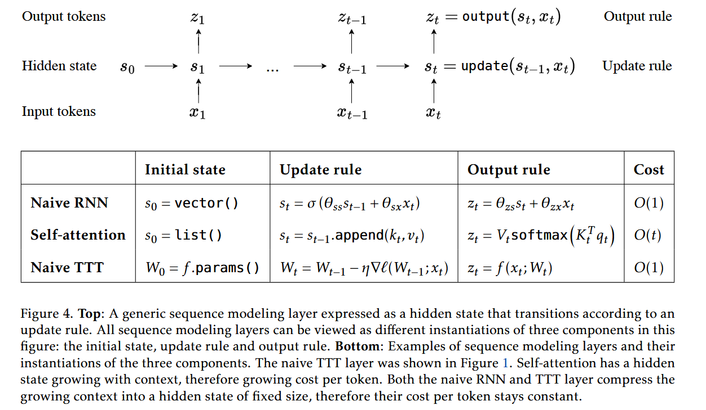
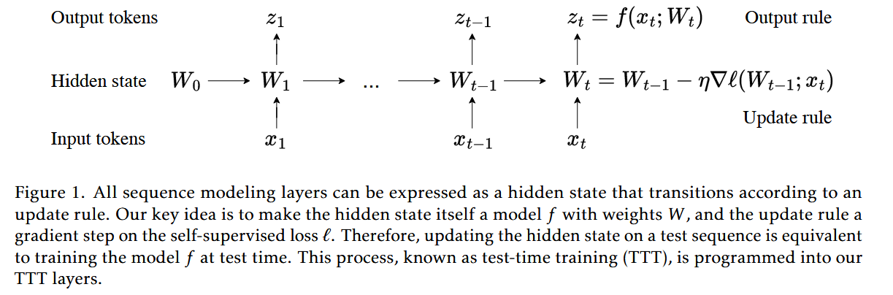
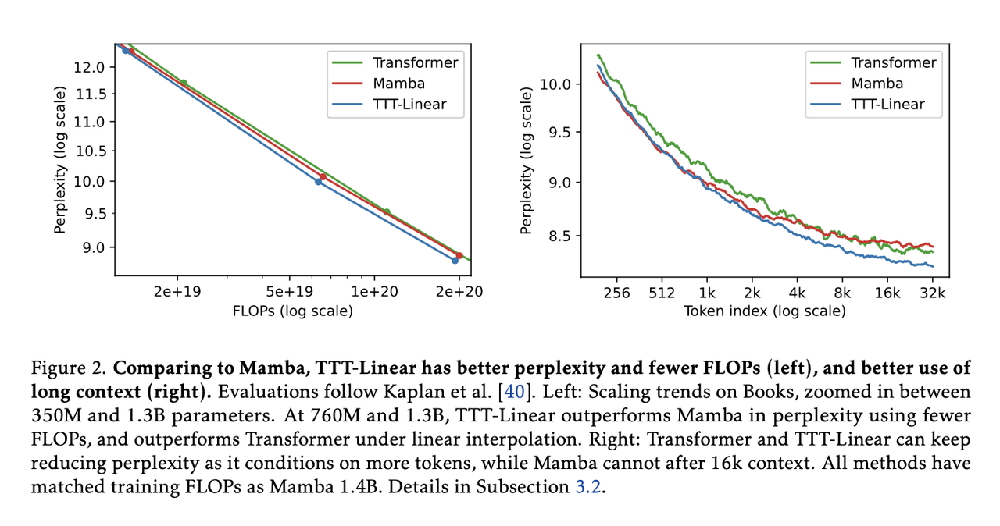
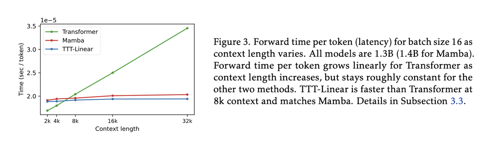
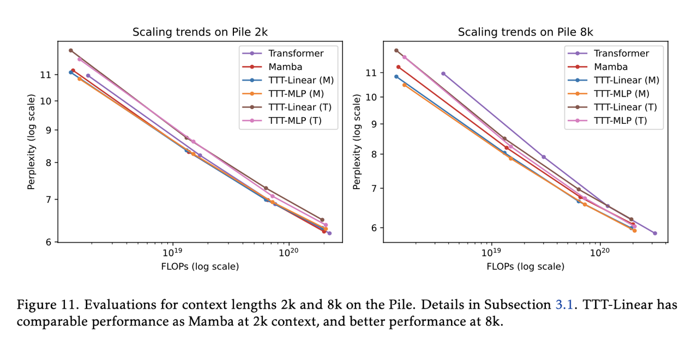
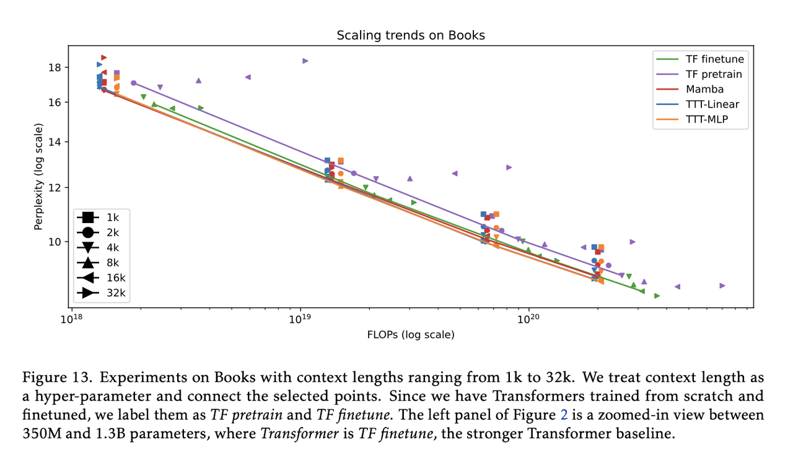

# Test-Time Training (TTT): A New Approach to Sequence Modeling

## The Current Challenges in Sequence Modeling
**Recurrent Neural Networks (RNNs)**:
- Existing RNN layers have linear complexity, but their performance in long context is limited by the expressive power of their hidden state.
- The struggle with long sequences and often forget important imformation from earlier in the text. 
- They are efficient. 
**Transformers**:
- Self-attention performs well in long context but has quadratic(二次) complexity.	
- They are excellent at understanding long texts and finding connections between different parts.
- They need a lot of computer power. 
**The researchers highlight that**: 
- RNN layers have to compress context into a hidden state of fixed size
- Self-attention can also be viewed from the perspective above, except that its hidden state, commonly known as the Key-Value(KV) cache, is a list that grows linearly with $t$
- Self-attention can capture long-range dependencies, but scanning this linearly growing hidden state also takes linearly growing time per token

## The main innovations of TTT:
**Expressive Hidden States**
- Each hidden state in TTT layers is a model, such as a linear model or two-layer MLP, which can be trained continuously to capture the context better. 
**Self-Supervised Update Rule** 
- The update machanism for the hidden state is based on self-supervised learning, enabling the model to update its parameters based on the input data even during test time. 

## The work process of TTT
The researchers created 2 versions of TTT:
1. **TTT-Linear**
	- Use a simple linear model as the hidden state
	- It's very fast and efficient
2. **TTT-MLP**:
	- Uses a MLP as the hidden state
	- It can understant more complicated patterns but needs a bit more computer power
Both versions work by continuously updating their understanding as they read through the text. The detailed mathematical formulas for the update rule and output rule are as follows:
- **Update rule**: 						$$W_t = W_{t-1} - \eta \nabla \ell(W_{t-1}; x_t)$$
	- $W_t$: equivalent to the hidden state $s_t$
	- $W_{t-1}$: equivalent to the hidden state $s_{t-1}$
	- $\eta$: learning rate
	- $\nabla$: the gradient operator
	
	- $x_t$: the $t$ time step of historic context $x_1$, ...,$x_t$
- **Loss**:		$$\ell(W; x_t) = \| f(\tilde{x}_i; W) - x_t \|^2$$
	- $\tilde{x}_i$: a low-rank projection $\tilde{x}_t = \theta_K x_t$, where $θ_K$ is a learnable martrix
	- $x_t$: the $t$ time step of historic context $x_1$, ...,$x_t$
	- $f$: the output rule function.\ $z_t = f (x_t; W_t).$
	- $W$: actually the hidden state, also the weight of model $f$, which can be a linear model or a small neural network
	- $\ell$: the  self-supervised loss function

- **Output rule:** 				$$z_t = f(x_t; W_t)$$
- $z_t$: the output sequence at $t$ timestep
- $f$: a model receives the input of $x_t$ and $W_t$, output $z_t$
- $x_t$: the $t$ timestep of historic context $x_1$, ...,$x_t$
- $W_t$: equivalent to the hidden state $s_t$

- **Parallelization with mini-batch TTT to improve efficiency**: 					$$G_t = ∇l (W_0; x_t) = 2(W_0x_t − x_t)x_t^T$$
- $G_t$: the gradient at $t$, for $t=1,...,b$
- More details are demonstrated in the paper... 
## The advantages of TTT

1. **Better with Long Texts**:
	-  Unlike RNNs, which tend to forget early parts of long text, TTT keeps improving its understanding throughout the entire text
	- Transformer and TTT-Linear can keep reducing perplexity as it conditions on more tokens, while Mamba connot after 16k context
	- TTT layers can take advantage of their larger hidden states to compress more information in long context, where TTT-MLP outperforms TTT-Linear, which in turn outperforms Mamba

2. **Faster Than Transformers**: 
	- TTT-Linear is faster than Transformer at 8k context and matches Mamba in wall-clock time
	- They achieve this efficiency through techniques like “mini-batch TTT and the dual form

## The performance of TTT
The researchers tested TTT thoroughly :
- They built large AI models with up to 1.3 billion parameters.
- They compared TTT to top-performing Transformer models and a new type of RNN called Mamba.
- They used diverse datasets, including “The Pile” and “Books3”.
- They tested with different text lengths, from short paragraphs to very long documents.
The results were impressive:
- TTT-Linear (M), Mamba, and Transformer have comparable performance at 2k context
- both TTT-Linear (M) and TTT-MLP (M) perform significantly better than Mamba at 8k context.

TTT was especially good with long texts, outperforming Mamba significantly. The authors note:
- A robust phenomenon we observe throughout this paper is that as context length grows longer, the advantage of TTT layers over Mamba widens

## Further Challenges
While TTT shows a lot of promise, there are still some challenges:
- Memory Usage: TTT-MLP, the more complex version, needs a lot of computer memory. 
Further Improvements:
- Trying new ways for the hidden state to learn from the text
	- “more sophisticated formulations of the self-supervised task”
	- “There are many other ways to parameterize a family of multi-view reconstruction tasks,
	- "perhaps a more general family of self-supervised tasks”
- Using more advanced AI models for the hidden state
	- "When context length becomes longer, $f$ would also need to be larger"
- Testing TTT on other tasks beyond just understanding text.

<!-- This is a sample blog post. Lorem ipsum I can't remember the rest of lorem ipsum and don't have an internet connection right now. Testing testing testing this blog post. Blog posts are cool.

Headings are cool
======

You can have many headings
======

Aren't headings cool?
------ -->